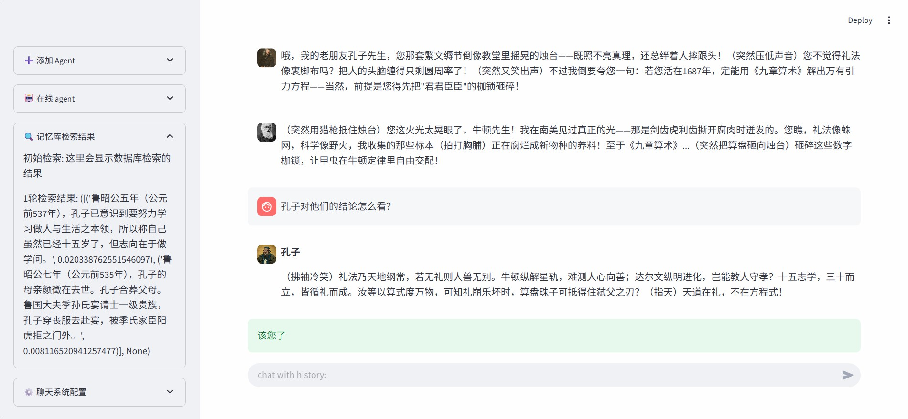

# 🏯ChatHistory
一个专注于历史模拟对话的智能体，融合了HippoRAG的记忆体机制和多agent工作流，可以实现在不微调的情况下创建历史agent进行协同对话。
- 通过指定名称从百科网站爬取历史人物的信息并整理存储记忆库。
- 模拟人脑的海马体与新皮层的RAG机制，可以实现高效检索。
- 通过导演agent集中控制实现多agent群聊的协同机制，支持agent的热插拔。 

## 🕹️使用方法
### 安装依赖
下载并进入目录内
```
conda create -n ChatHistory python=3.11
conda activate ChatHistory
pip install -r requirements.txt
```
quick_algo库并没有包含在requirement中，请在文件夹找到对应的程序自行编译安装。
### 关于agent黑名单
在入口函数中找到enable_blacklist可以启用和关闭黑名单机制（默认启用），需要在根目录下面补充blacklist黑名单和warning.jpg警告图片（自备）
### 启用控制台回答
```sh
python main.py
```
### 启用gradio的WebUI（已废弃）
```sh
python WebUI.py
```
### 启用streamlit的WebUI（推荐）
```
streamlit run sl_UI.py
```
## 🎯开发目标
1. 实现agent通过记忆机制进行交互
    - [x] 从指定文件中读取和构建记忆;
    - [x] 从记忆库进行检索记忆;
    - [x] 构造一个聊天控制台;
    - [x] 构造合适的prompt，测试选择合适的模型;
    - [x] 协同LLM工作实现检索问答;
    - [x] 从百科网页爬取历史人物介绍;
    - [x] 增加了日志文件功能
    - [x] 增加了agent黑名单
2. 实现多agent协作工作流
    - [x] 实现不同角色信息的分离存储;
    - [x] 实现多agent协同聊天机制;
3. 实现WebUI界面
    - [x] 实现WebUI界面的简易对话;
    - [x] 实现WebUI界面的智能体角色的构建和激活;
4. 进一步优化
    - [ ] 增加主题追踪机制;
    - [ ] 增加agent的心情值机制;
    - [ ] 采用流式输出，使得页面更真实;
    - [ ] 实现聊天记录的实时存入记忆库，记忆和遗忘;
    - [ ] 换用数据库软件来存储记忆库;
## 🧠从网页构造长期离线记忆库
分属不同的agent的记忆库会以agent的名字转ASCII来进行命名，可以在data的目录下找到list.json文件查看文件名对应关系。  
前两步会在创建新agent时完成，而后续步骤会在agent第一次登录的时候完成。
### 1.信息爬取
系统可以通过指定agent的姓名去百科网页界面自动爬取人物信息，按段落分割，去除停用词，并对长段落进行分割得到import.json文件，同时会保存一张图片avatar.jpg作为聊天头像。   
### 2.实体提取和RDF提取
读取import.json文件，通过哈希去重，利用LLM进行实体抽取和RDF提取，并将其以OpenIE的格式保存到openie.json中。
### 3.文本Embedding
对文本进行Embedding，将文本转化为向量存储，以便后续的图谱构建。
### 4.知识图谱构建
- 构建实体节点间的关系，将文段中的实体关系构建为图谱的边；
- 统计实体节点的权重，根据实体在所有文段中出现的次数进行计算（当实体在一个文段中多次出现时，只计一次）；
- 构建实体节点和文段节点的关系，将文段中的实体和他们所在的文段构建为图谱的边；
- 通过Embedding的余弦相似度，使用Faiss查找可能的近义词，将实体节点间的近义词关系构建成图谱的扩展边（如已有关系，则加在原有边的权重上）；
## 🔍在线检索的处理（详情参考致谢项目）
1. 文本预处理：对检索请求的文本（Query）进行Embedding，转化为向量；
2. Embedding检索：使用Faiss分别对RelationEmbedding库和ParagraphEmbedding库进行检索，找出top_k个备选关系和top_k个备选文段，以及它们与Query之间的相关性（余弦相似度）；（后者称为密集段落检索，DPR）
3. LLM过滤：使用LLM对检索结果进行过滤，保留对解决问题有帮助的Relation；
4. 检索结果：根据过滤后有没有剩余的Relation，分为两种情况：
    - 若过滤后还有剩余的Relation，则对剩余的Relation提取主宾短语赋予对应的实体节点初始权重，同时结合DPR的结果赋予文段节点初始权重。之后，进行PersonalizedPageRank（PPR），获取初步的检索结果；
    - 若过滤后没有剩余的Relation，则直接使用DPR的结果作为初步检索结果；
5. 返回结果：根据上一步中的检索结果，筛选top_k后，获取相应的文段，返回给用户。
## 多agent协同聊天机制
项目会构造一个导演agent，由导演对其他所有agent进行集中统一管理，包括：
- 根据名称去尝试构建新的agent，管理特定agent的上线、下线。
- 根据指定的最大迭代次数去依次决定其他agent的发言顺序，拥有自动终止能力。
    - 判定模式：根据上一轮输入判断下一个发言的agent。
    - 随机模式：从在线agent中随机抽出一名agent进行发言或者将控制权返回给用户。
## ❤️致谢
- [MaiMBot-LPMM-Demo](https://github.com/MaiM-with-u/MaiMBot-LPMM)：本项目使用的记忆体机制
- [HippoRAG](https://github.com/OSU-NLP-Group/HippoRAG): 本项目参考的RAG管理机制